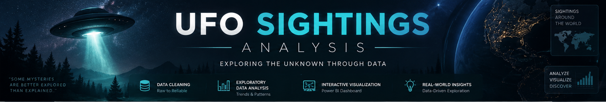

<p align="center">
  
</p>

<p align="center">
  <strong>Data Cleaning · Exploratory Data Analysis · Power BI Visualization</strong>
</p>

<p align="center">
  An end-to-end data analytics project focused on cleaning,
  exploring, visualizing, and understanding UFO sighting data.
</p>

<p align="center">
  <a href="notebook/Data-Cleaning-Analysis.ipynb">View Analysis Notebook</a>
  &nbsp;&nbsp;•&nbsp;&nbsp;
  <a href="dashboard/IBM-Final.pbix">View Power BI Dashboard</a>
</p>

---

## Overview

The **UFO Sightings Analysis** project focuses on transforming raw UFO
sighting data into structured information and visual insights.

The project follows a practical data analytics workflow:

```text
Raw Dataset
     │
     ▼
Data Cleaning
     │
     ▼
Data Preprocessing
     │
     ▼
Exploratory Data Analysis
     │
     ▼
Data Visualization
     │
     ▼
Power BI Dashboard
     │
     ▼
Insights & Patterns